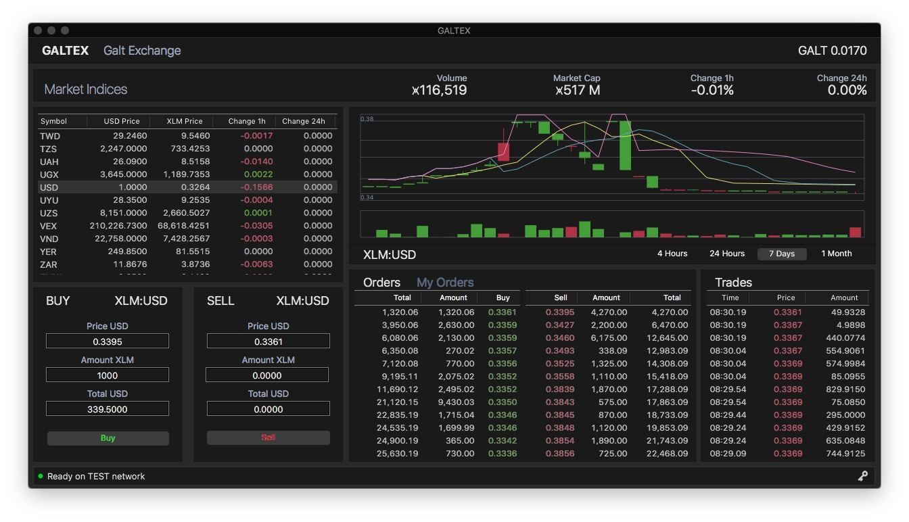

# GaltEx Trading Desktop for macOS platform

As an alternative to the web client, **GaltEx Trading Desktop** is the most innovative application for the macOS platform to trade crypto assets on SDEX - Stellar Decentralized Exchange.

It will allow you to trade in four different markets:

- Forex listing more than a hundred world currencies
- Crypto listing the top hundred crypto currencies like XLM, BTC, ETH, etc
- Wall St. listing the top hundred stocks from Dow Jones and Nasdaq
- Galt St. listing all assets created by startups on the Stellar Network

In order to use **GaltEx Trading Desktop** all you need to have is a Stellar account. You will be able to buy and sell assets from your own computer without having to share your secret keys with the web. You can also login with your public key in read only mode to track your orders. Keys are stored on the Keychain and never transmitted anywhere. We advise you to never share your secret keys in websites or apps you don't trust.

**GaltEx Trading Desktop** is part of the financial services provided by [GaltBank](https://galtbank.com), the first crypto bank in the world with the most advanced and feature rich desktop and mobile wallets. **GaltBank** also offers payment services for your shopping needs so you can trade, shop and save with confidence backed by the most trusted bank on the blockchain.

[https://galtbank.com/galtex](https://galtbank.com/galtex)

In Code We Trust

## Credits

**GaltEx** uses the following external libraries:

- [StellarSDK](https://github.com/kuyawa/StellarSDK) in Swift by Kuyawa
- [JSUStockCharts](https://github.com/BestSwift/JSUStockChat) by 苏小超

## License

LLX - Libertarian License Xtended

Take all you can, leave nothing behind
